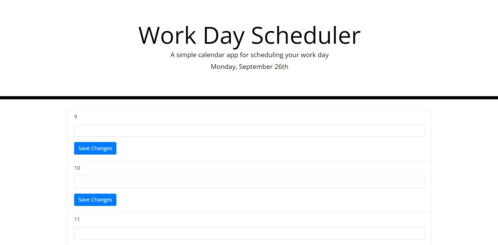

# 05_calendar

## Description

This lab was done in order to practice using jQuery and Moment.js.
The created website is intended to act as a planner for the duration of a typical work day, allowing the user to enter in an activity on a certain time slot and save it.
This project allowed me to get practice using jQuery in place of standard JavaScript commands and to get practice displaying dates using Moment.js.

## Installation

N/A

## Usage

This website can be used as a planner for during a standard 9a to 5pm work day. Time slots that have already passed will be always be coloered grey, time slots that are in the fututre but occupied by an event will be colored green, time slots that in the future but are not occupied by an event will be colored white, and the time slot equal to the current hour will be colored red. An event can be added to or edited in a time period by typing a value into a box inside a time period and clicking the save changed button. The events and the times they take place will be saved in local storage.

## Credits

N/A

## License

Please refer to the license in the repo

## Links and Images
Github pages URL: https://fortu038.github.io/05_calendar/

